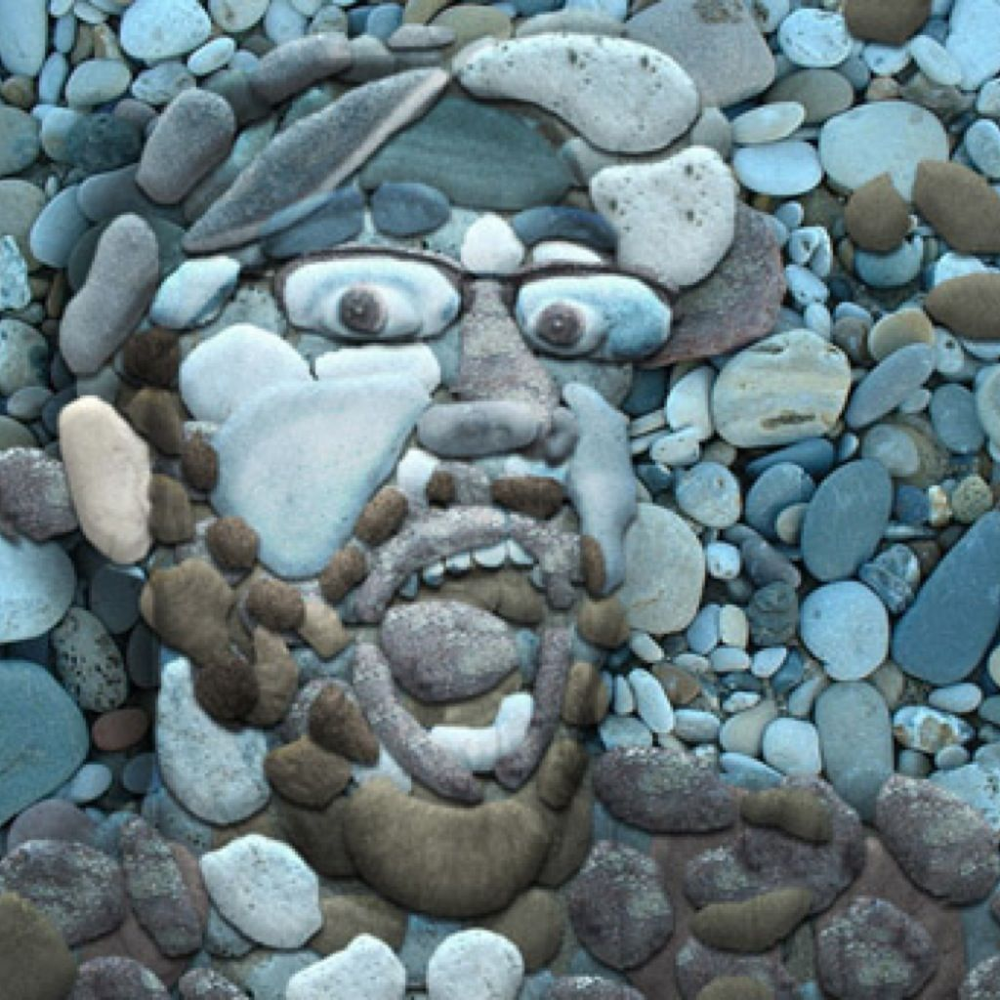
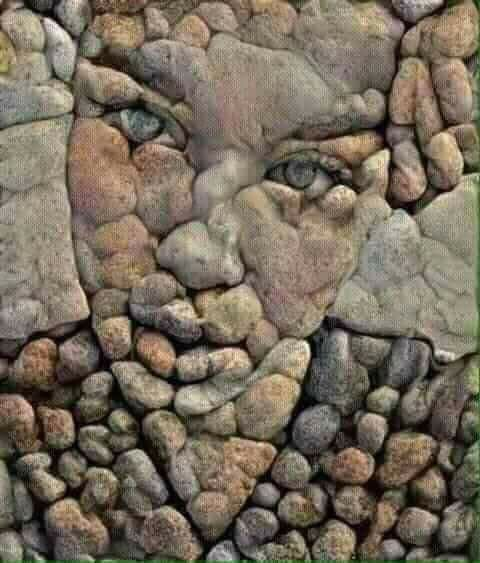

# Stone-face-images
Generate human faces made from stone using Pix2Pix GAN.

<p align="center">


</p>
<p align="center">
<em>image credits: <a href="https://in.pinterest.com/pin/444449056973970144/">this</a> and <a href="https://www.pinterest.ie/pin/257901516143906841/">this</a>.</em>
</p>

## Introduction

This task is a subset of general image-to-image translation tasks like converting black and white image to coloured image. The absence of target image( i.e. stone faces) examples makes this problem trickier. In our experiments, we train Pix2Pix GAN with stone images and their contours. We use diverse stone images to generate a variety of contours with the aim that GAN generalizes well and can fill contours of faces with stone textures.

## Requirements

- Pix2Pix GAN ([this Github repo](https://github.com/affinelayer/pix2pix-tensorflow) or other implementations)
- Structured Edge Detection Toolbox ([repo](https://github.com/pdollar/edges)) to extract contours. Installation and usage instructions are mentioned on the webpage. Depending upon the Matlab version, there are chances of getting a compilation error while compiling ".cpp" files. This is generally due to introduction of new C type "mwSize" for mxArray ([reference](https://uk.mathworks.com/help/matlab/apiref/mwsize.html)). Updated files are available in the assets folder.
- Matlab\Octave
- Pillow 

## File Structure

The files and scripts for reproducing the experiments are organized as follows:

```
.
+-- assets/ : c++ files for edge detection.
+-- base stones/ : stone images for background.
+-- single stones/ : small stone images.
+-- experiments/ : experiments with different datasets.
|   +-- 1/ : initial experiments.
|   +-- 2/ : experiments with black background.
|   +-- 3/ : experiments with large stone background.
+-- create_dataset.ipynb : iPython notebook to create the dataset for experiments 2 and 3.
```